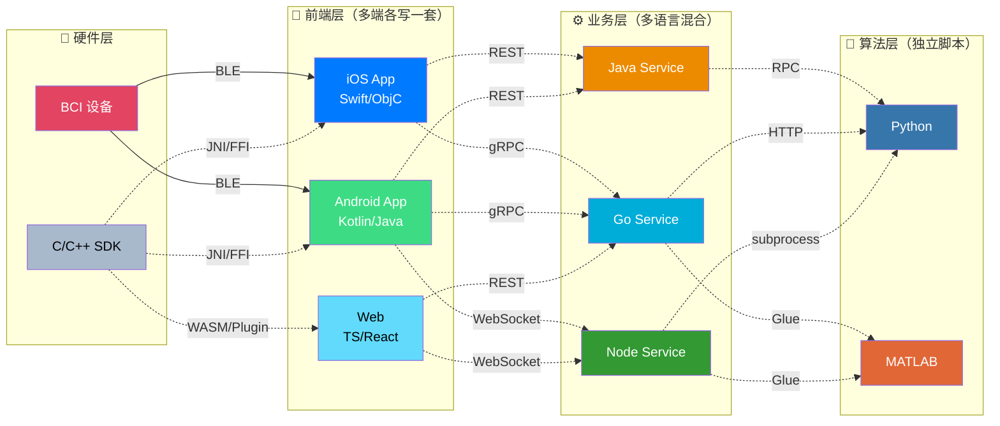
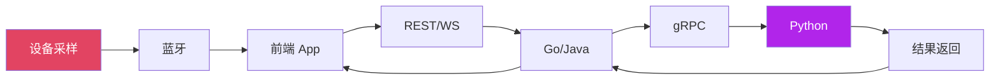
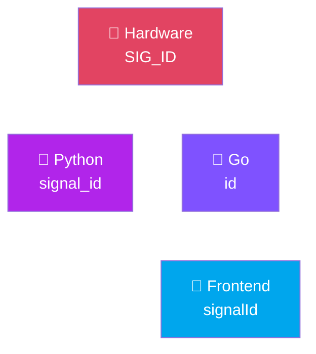
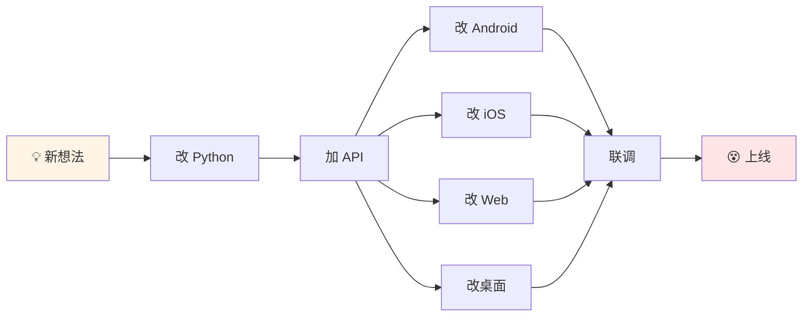

# Part 1：老架构的坑

---

# 典型老架构长什么样？

**看起来「分层明确」，用起来「胶水代码泛滥」**

<!--
**P3 典型老架构长什么样**
⏱️ 2:00 - 3:30

先看一个典型的脑机 + AI 项目架构。

左边是硬件，BCI 设备通过蓝牙把数据发给前端。

前端这一层，Web 用 WebBluetooth，Android 用原生蓝牙 API，iOS 用 CoreBluetooth，各端收到数据后通过 REST 或 WebSocket 发给后端。

后端有人用 Go，有人用 Java，负责接收数据、存储、调用算法。

最右边是 Python 算法服务，用 NumPy、PyTorch 做信号处理和推理。

图上画起来分层很清晰，但实际维护起来，每一层都有问题。
-->

---

# 问题 a：技术割裂

### 算法团队

- Python
- NumPy / Pandas
- PyTorch

### 业务团队

- Go / Java
- 各种 Web 框架

### 客户端

- Swift / Kotlin
- TS / React…

 

### 结果

- 一条链路上可能经过 **3～5 种语言**
- 数据结构在不同语言中被 **一次次手写、一次次不完全一致**

> **技术栈是松耦合的，人是高耦合的**

<!--
**P4 问题 a：技术割裂**
⏱️ 3:30 - 4:30

第一个问题是技术割裂。

算法团队用 Python，业务团队用 Go 或 Java，前端用 Swift、Kotlin、TypeScript。
各用各的没问题，问题是同一条业务链路上要穿过 3～5 种语言。

举个例子：一个「Session」概念，Python 里是个 dict，Go 里是个 struct，前端是个 TypeScript interface。字段名、类型、含义可能都有细微差别。

结果就是，写代码的时间比不上对齐概念和协议的时间。
-->

---

# 问题 b：性能与实时性瓶颈

每一跳都可能：

- 做一次序列化 / 反序列化
- 做一次大数组拷贝
- 做一次类型转换

> **跨语言调用 + 数据拷贝，是实时系统的隐形杀手**

<!--
**P6 问题 b：性能与实时性瓶颈**
⏱️ 4:30 - 5:30

第二个问题是延迟。

一般 Web 项目延迟高一点，用户感觉卡一下。但脑机接口场景，延迟直接影响体验和实验有效性。

一个数据包要经过：设备采样 → 蓝牙 → 前端 → REST/WebSocket → 后端 → gRPC → Python → 原路返回 → 前端渲染。

每一跳都可能做一次序列化、大数组拷贝、类型转换。单看一跳没啥，叠加起来就是：信号是实时的，UI 总是慢半拍。

而且问题不好查，你很难区分是 Python 慢了、网络慢了、还是哪边 GC 抖了。
-->

---

# 问题 c：协议层混乱

### RPC/API 层面的问题

- **协议混用**
    - gRPC / REST / WebSocket
    - 自定义二进制协议

- **文档割裂**
    - Swagger / 手写 Markdown
    - Wiki / 口口相传

- **模型不一致**
    - 同一份概念
    - 三四份略微不同的 schema

 

### 典型场景

"这个字段在硬件里叫 `SIG_ID`，Python 里叫 `signal_id`，Go 里叫 `id`，前端叫 `signalId`"

> **多语言杂糅带来的成本不只是心累，是直接的开发和维护成本**

<!--
**P5 协议层的混乱：多语言带来的通信成本爆炸**
⏱️ 5:30 - 6:30

第三个问题是协议混乱。

有人用 gRPC，有人坚持 REST，有人喜欢自定义二进制协议。
API 文档一部分在 Swagger，一部分在 Wiki，还有一部分在某个不更新的 Confluence 里。
同一个概念，Python 里叫一个名字，Go 里叫另一个名字，前端再叫第三个名字。

然后就有经典对话：

「为啥线上这个字段是 null？」
「因为 Python 那边改了个默认值，文档还没更新。」

系统复杂度很大一块是「多语言 + 多份协议副本」叠出来的。
-->

---

# 问题 d：跨平台 & 可扩展性不足

### 客户端碎片化

  
Android

  
iOS

  
Web

  
鸿蒙

  
桌面

每个平台一套 **UI**，一套 **状态管理**，一套 **网络栈**

### 新实验的代价

> **新功能上线很慢，实验迭代成本高，很多想法死在「实现太麻烦」上**

<!--
**P7 问题 c：跨平台 & 可扩展性不足**
⏱️ 6:30 - 8:00

最后一个问题是扩展成本高。

Android 有自己的 App，iOS 有自己的 App，Web 有自己的项目，有时还搞个桌面端。

想做一个新功能，比如换一种脑电波可视化方式，你要做的事情是：
- 算法团队改 Python 输出
- 后端加一个 API
- 每个前端都改一遍
- 然后一起联调，看谁的字段名写错了

结果就是想法很多，真上线的很少。不是不想做，是改动成本太高。
-->
