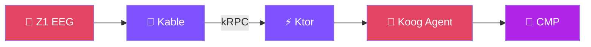

# Part 2： 登场

---

#  是什么？

** = Kotlin 全栈驱动的脑机接口 +
智能体实践项目**

 

用 **一门语言** 打通：

- 硬件数据接入
- 实时信号处理
- 服务端编排
- 客户端交互
- Agent 逻辑

 

<!--
**P8 Zherica 是什么 - 完整演讲稿**
⏱️ 8:00 - 9:30

基于前面这些问题，我们开始做 Zherica 这个项目。

目标很简单：用 Kotlin 全栈，把脑机接口到智能体的链路串起来。

几个硬性约束：
1. 主链路只用 Kotlin
2. 模型和 Intent 只定义一份，前后端和 Agent 都复用
3. 算法先在服务端跑，之后可以往客户端甚至硬件端移

技术栈就是：Kable 接 BCI 设备、Ktor 做服务、Compose Multiplatform 做前端、Koog 做 Agent，中间用 kRPC 和 RSocket 串起来。
-->

---

#  Show Demo

  

  <video src="/demo.mov" class="h-full max-w-52 rounded-lg shadow-lg" controls loop />

**Demo Content:**

- 🧠 实时 EEG 信号采集
- 📊 情绪状态分析可视化
- 🤖 Agent 智能反馈建议
- 📱 多平台统一体验

**技术亮点**

整个链路从硬件到 UI， **没有跨语言调用**

<!--
**P9 Demo 视频讲解 - 完整演讲稿**
⏱️ 9:30 - 11:00

先看一下实际效果。

（播放 Demo 视频）

Demo 里可以看到：
- 左边是实时的脑电波信号
- 中间是 Agent 根据信号做的状态判断，比如放松、专注还是疲劳
- 右边是 Agent 给出的建议

数据从硬件流入 Kable，再到 Ktor，再到 Agent，最后到前端，主干逻辑没有跨语言调用。
-->
