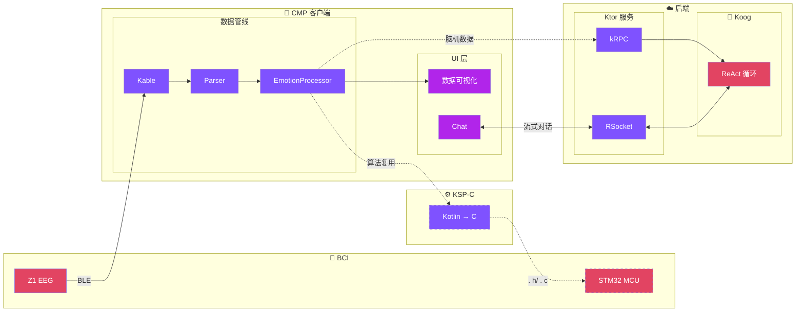
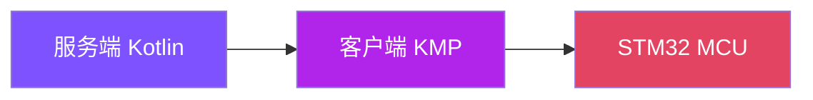
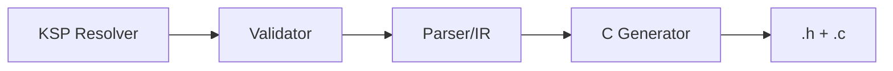
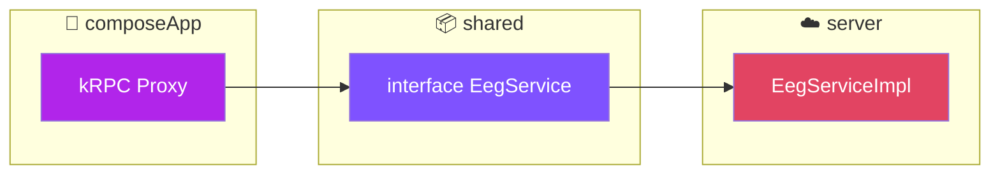

# Part 3：新架构的核心思路

---

# 新架构鸟瞰



<div class="mt-2 text-center">

**数据流：** `Z1 → Kable → Parser → Processor` | **通信：** kRPC · RSocket | **复用：** KSP-C

</div>

<!--
**P10 新架构鸟瞰**
⏱️ 11:00 - 12:30

看一下架构图，从左到右：

左边 BCI 设备通过 BLE 连接到 Kable。

中间是 CMP 客户端的数据管线：Kable 接收原始数据，Parser 解析双通道 EEG，EmotionProcessor 计算情绪状态，最终渲染到数据可视化 UI。

右边是后端：Ktor 服务暴露 kRPC 和 RSocket 两个端点，Koog Agent 采用 ReAct 循环处理用户交互。

两条通信路径：脑机数据走 kRPC 上传，Chat 对话走 RSocket 流式响应。

关键是所有节点都是 Kotlin，统一用协程和 Flow，共享同一份数据类。
-->

---

# 统一 Intent 数据结构

<div class="grid grid-cols-2 gap-8">
<div>

### 旧世界

协议在不同语言中各有一份定义

```python
# Python
class Session:
    signal_id: str
```

```go
// Go
type Session struct {
    ID string `json:"id"`
}
```

```typescript
// TypeScript
interface Session {
    signalId: string
}
```

</div>
<div>

### 新世界

```kotlin
// Kotlin - 唯一定义
data class Session(
    val signalId: String
)
```

同一份模型：

- 后端 Ktor 直接用
- Compose Multiplatform 直接用
- Koog Agent 复用

> **API Model ≈ 业务 Model ≈ Agent Model**

</div>
</div>

<!--
**P11 统一 Intent 数据结构**
⏱️ 12:30 - 14:00

老架构里，一个业务动作可能有好几套定义：协议层一个 protobuf，业务代码里一个内部对象，前端再搞一套接口类型。

在 Zherica 里我们收敛成一份：Intent / State / Event 全部用 Kotlin 定义。

比如一个 `BrainStateIntent`：
- 前端点击按钮发给后端的请求结构
- Agent 子任务要接收的输入类型
- 服务端内部逻辑中流转的对象

都是同一个东西。配合 KSP 可以从这份 Model 生成接口文档和序列化代码，API 文档就是源码的投影，不会过期。
-->

---

# 算法复用路径



**核心算法：Affstate 情绪识别**

- 2 通道 EEG (FP1/FP2) + 5 频段 (δθαβγ)
- FAA 前额不对称性 = α_right - α_left
- 引入类似 DataFrame 的抽象（考虑 KMP 兼容性）

**演化路径：**

1. **一开始**：在服务端 Kotlin 实现，部署安全、易调试
2. **之后**：性能瓶颈暴露，搬到客户端（KMP）减少网络延迟
3. **再往后**：用 **KSP-C 转译器** 生成 C 代码，部署到 STM32

> **算法代码只写一遍 Kotlin**，自动生成 C，在不同位置复用

<!--
**P12 算法复用路径：从服务端到客户端再到硬件**
⏱️ 14:00 - 15:30

看一下算法的演化路径。

核心算法是 Affstate 情绪识别：基于 2 通道 EEG 数据（FP1/FP2），5 个频段，核心指标是 FAA（前额不对称性）。

一开始我们把算法写在服务端：Kotlin 上手快，部署安全，好调试。

跑着跑着发现有些计算放在服务端，网络往返一圈，延迟还是难受。于是把那部分逻辑移到客户端用 KMP 复用，相同的 Kotlin 源码，在 Android / Desktop 端本地执行。

再往后，我们做了 KSP-C 转译器：用 KSP 扫描标记了 `@CFunction` 注解的函数，自动生成 C 代码，可以在 STM32 MCU 上编译运行。
-->

---

# KSP-C 转译器：Kotlin → C

<div class="grid grid-cols-2 gap-4">
<div>

### 三个注解

| 注解           | 作用            |
|--------------|---------------|
| `@CModule`   | 标记文件为模块       |
| `@CExport`   | 导出 data class |
| `@CFunction` | 导出函数          |

### 转译流程



### 自动处理细节

- camelCase → snake_case
- `log10` → `log10f`
- 类型和控制流完整转换

</div>
<div>

```kotlin
@CFunction
fun calculateFaa(
    alphaFp1: Float,
    alphaFp2: Float
): Float {
    if (alphaFp1 <= 0.0f) return 0.0f
    val logFp1 = log10(alphaFp1)
    return log10(alphaFp2) - logFp1
}
```

⬇️

```c
float calculate_faa(
    float alpha_fp1,
    float alpha_fp2
) {
    if (alpha_fp1 <= 0.0f) return 0.0f;
    const float log_fp1 = log10f(alpha_fp1);
    return log10f(alpha_fp2) - log_fp1;
}
```

</div>
</div>

<!--
**P12-b KSP-C 转译器：已实现的 Kotlin → C 方案**
⏱️ 15:30 - 17:00

这是我们已经实现的东西：Kotlin-to-C 转译器。

痛点是算法需要在服务端、移动端、嵌入式三个环境运行。传统方式是三种语言写三遍，祈祷它们行为一致。

我们的方案是写一遍 Kotlin，自动生成 C。

三个核心注解：
- `@CModule`：标记文件是一个 Kotlin-C 模块
- `@CExport`：标记 data class 导出为 C 结构体
- `@CFunction`：标记函数导出为 C 函数

流程是：KSP Resolver 扫描注解 → Validator 检查类型约束 → Parser 生成 IR → Generator 输出 .h + .c
-->

---

# 完整代码示例：从 Kotlin 到 C

<div class="grid grid-cols-2 gap-4">
<div>

**Kotlin 输入**

```kotlin
@file:CModule
package com.dknsf.mental.health.affstate.clike

const val EMOTION_JOY = 0

@CExport
data class EegFrame(
    val alphaFp1: Float,
    val alphaFp2: Float
)

@CFunction
fun calculateFaa(
    alphaFp1: Float,
    alphaFp2: Float
): Float {
    if (alphaFp1 <= 0.0f) return 0.0f
    val logFp1: Float = log10(alphaFp1)
    return log10(alphaFp2) - logFp1
}
```

</div>
<div>

**C 输出 (affstate_cmodule.h + .c)**

```c
#define EMOTION_JOY 0

typedef struct {
    float alpha_fp1;
    float alpha_fp2;
} EegFrame;

float calculate_faa(
    float alpha_fp1,
    float alpha_fp2
) {
    if ((alpha_fp1 <= 0.0f)) {
        return 0.0f;
    }
    const float log_fp1 = log10f(alpha_fp1);
    return (log10f(alpha_fp2) - log_fp1);
}
```

**状态：** STM32CubeIDE 编译通过 ✓

</div>
</div>

<!--
**P12-c 代码对比演示**
⏱️ 17:00 - 18:30

左边是 Kotlin 代码，右边是生成的 C 代码。

注意几个自动处理的细节：
- 命名从 camelCase 转成 snake_case
- `log10` 自动映射成 C 的 `log10f`
- 类型和控制流完整转换

生成的代码已经在 STM32CubeIDE 里编译通过，可以直接烧到 MCU 上。

核心思路是：算法只写一遍 Kotlin，用工具链投射到不同运行时。
-->

---

# kRPC：脑机数据的专用通道

```kotlin
interface EegService {
    suspend fun uploadFrame(frame: EegFrame): UploadResult
    suspend fun uploadBatch(frames: List<EegFrame>): BatchResult
}
```

- **传输层无关设计**，当前基于 WebSocket 实现
- 客户端调用像本地函数：`eegService.uploadFrame(frame)`

### 职责分工

| 协议          | 用途        |
|-------------|-----------|
| **kRPC**    | 脑机数据上传    |
| **RSocket** | Chat 流式响应 |

<div class="flex justify-center">



</div>

<!--
**P13 kRPC：脑机数据的专用通道**
⏱️ 18:30 - 20:00

RPC 这一层，我们用 kotlinx-rpc（kRPC）来传输脑机数据。

在 Kotlin 世界里，你写的就是一个接口，客户端调用 `eegService.uploadFrame()` 感觉就像本地函数调用，实际底下是带序列化的远程调用。

kRPC 专门用于脑机数据上行，聊天这种需要流式响应的场景用 RSocket。

好处是：
- 对 Kotlin 工程师来说，心智模型就是一个 Kotlin 接口 + 协程
- 职责清晰：kRPC 管数据上传，RSocket 管流式对话
- 减少胶水代码，保留强类型安全
-->
