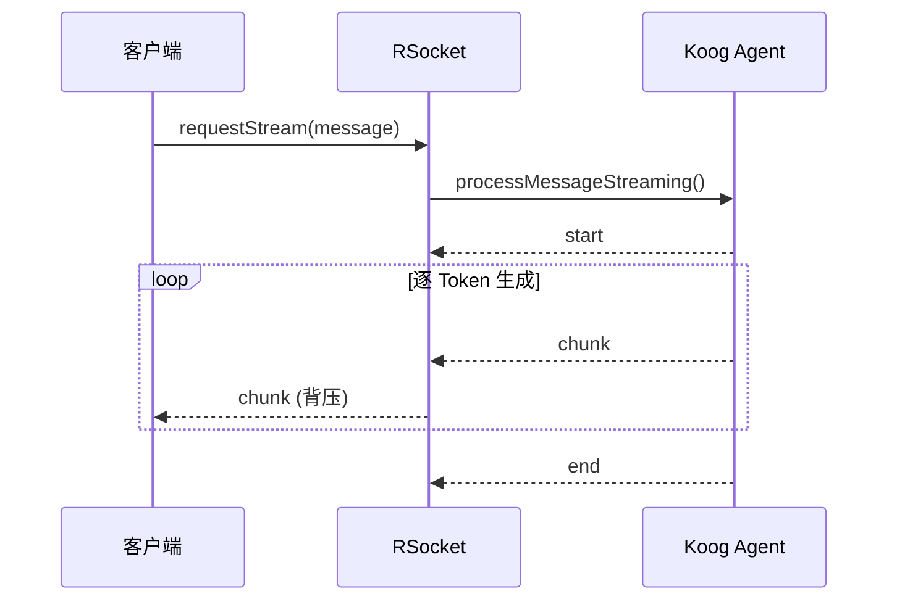
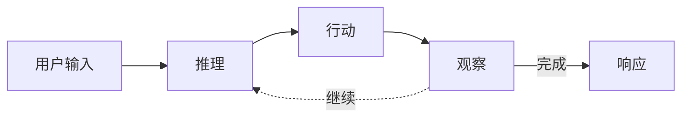

# Part 5：后端 & Agent

---

# Ktor 后端：项目结构与 Native 云原生

<div class="grid grid-cols-2 gap-4">

<div>

## 技术栈 & 项目结构

**Ktor + Koin + Exposed + kRPC + RSocket**

```
shared/                    # 跨平台共享
├── api/                   # kRPC 接口定义
│   └── CalibrationService.kt
├── model/                 # 数据模型
└── core/                  # 核心算法
server/                    # 服务端实现
├── service/               # kRPC 实现 + 业务逻辑
├── controller/            # REST & RSocket 端点
├── repository/            # 数据访问层
└── agent/                 # AI Agent 工具
```

</div>

<div>

## 为什么要 Native 编译？

**边缘节点场景**：低延迟 + 资源受限

| 方案            | 结论               |
|---------------|------------------|
| **GraalVM**   | ✓ Ktor 官方支持，生态成熟 |
| Kotlin/Native | ✗ 库兼容性不足         |

<div class="mt-3 p-2 bg-green-50 dark:bg-green-900 rounded text-sm">

**效果**：启动 < 100ms，内存 ↓ 80%

</div>

</div>

</div>

<!-- 演讲备注 -->
<!--
**P17 Ktor 后端 & Native 编译**
⏱️ 24:30 - 26:00

后端技术栈：Ktor 做 Web 框架，Koin 做依赖注入，Exposed 做数据库 ORM，kRPC 处理脑机数据上行，RSocket 处理 Chat 流式下行。都是 Kotlin 原生的库，配合起来很顺。

项目结构分两层：
- shared 放跨平台共享代码，重点是 api 目录——kRPC 的接口定义在这里，客户端和服务端都依赖它，实现类型安全的 RPC 调用
- server 放服务端实现，service 层既实现 kRPC 接口，也包含业务逻辑

为什么要 Native 编译？因为我们有边缘节点的场景——部署在离用户近的地方，对启动速度和资源占用有要求。传统 JVM 启动要几秒，内存占用也大，不适合边缘设备。

调研了两个方案：Kotlin/Native 理论上更纯粹，但 Ktor 支持不成熟，很多库不兼容。GraalVM Native Image 把 JVM 字节码 AOT 编译成原生二进制，Ktor 官方支持，生态完善。

最终选择 GraalVM，效果是启动时间从几秒降到 100ms 以内，内存占用降低 80%。
-->

---

# RSocket：Chat 流式响应

<div class="grid grid-cols-2 gap-4">

<div>

```kotlin
// 服务端：Agent 流 → RSocket Payload
aiAgentService.processMessageStreaming(userId, message)
    .map { chunk -> when (chunk) {
        STREAM_START_MARKER -> RSocketChatResponse("start")
        STREAM_END_MARKER -> RSocketChatResponse("end")
        else -> RSocketChatResponse("chunk", chunk)
    }}

// 客户端：collect 消费流
rSocket.requestStream(payload)
    .collect { emit(response.content) }
```

</div>

<div>



</div>

</div>

<div class="mt-4 grid grid-cols-3 gap-3 text-sm">

<div class="p-3 bg-purple-50 dark:bg-purple-900 rounded">

**kRPC** → 脑机数据上行

- 批量帧上传
- 请求-响应模式

</div>

<div class="p-3 bg-blue-50 dark:bg-blue-900 rounded">

**RSocket** → Chat 流式下行

- request-stream 模式
- 内建背压支持

</div>

<div class="p-3 bg-green-50 dark:bg-green-900 rounded">

**RSocket-Kotlin**

- 官方原生协程支持
- suspend + Flow 全链路

</div>

</div>

<!-- 演讲备注 -->
<!--
**P18 RSocket：Chat 流式响应**
⏱️ 26:00 - 27:30

刚才讲 kRPC 负责脑机数据上行，这里 RSocket 负责 Chat 流式下行，两者形成职责互补。

为什么需要两个协议？场景不同：
- 脑机数据是「客户端批量上传，服务端单次响应」，适合 kRPC 的请求-响应模式
- Chat 是「客户端发一条，服务端流式回」，需要 RSocket 的 request-stream 模式

RSocket-Kotlin 是 RSocket 官方维护的 Kotlin 实现，原生支持协程——API 直接就是 suspend 函数和 Flow，不需要适配器或桥接层。

看代码，服务端 `processMessageStreaming()` 返回 Flow，每个 Token 发一个 `chunk`，客户端通过 `collect` 按自己节奏消费。整条链路都是协程，没有回调地狱。

背压的好处：AI 生成快时客户端不会爆内存，慢时也不会断流。用户边看边等，体验和 ChatGPT 一样。

关键是统一协程模型：不管 kRPC 还是 RSocket，Kotlin 侧都是 suspend 函数和 Flow，心智模型一致。
-->

---

# Koog Agent + ReAct 模式

<div class="grid grid-cols-2 gap-6">

<div>



<div class="mt-2 text-sm">

| 阶段     | 说明                             |
|--------|--------------------------------|
| **推理** | LLM 分析输入和上下文                   |
| **行动** | 调用工具如 `GetUserAssessmentsTool` |
| **观察** | 处理返回结果，决定继续或响应                 |

</div>

<div class="mt-2 text-xs text-gray-600 dark:text-gray-400">

💡 每步推理结果通过 RSocket 流式推送到客户端，实现实时反馈

</div>

</div>

<div>

## IntelliJ Agent Debugger

- 可视化 Agent 每一步的输入/输出
- 回放交互链路，查看工具调用事件流

<div class="my-3 p-3 bg-blue-50 dark:bg-blue-900 rounded text-sm">

**关键特性**：Agent 不再是黑箱，而是可调试的 Kotlin 协程树

</div>


</div>

</div>

<!-- 演讲备注 -->
<!--
**P19 Koog Agent + IntelliJ Agent Debugger**
⏱️ 27:30 - 29:00

Agent 用 Koog 来做编排，把「脑机状态 → 决策 → 行动」拆成树形结构：
- 感知节点：读取 BCI 信号和环境上下文
- 规划节点：基于当前状态选择策略
- 行动节点：触发 UI 更新、声音提示等

每个节点本质上就是一个 Kotlin 函数或协程，接受统一的 Intent / State，输出新的 State 或 Action。

调试时配合 IntelliJ 的 Agent Debugger 插件，可以看到每个节点实际收到什么输入、输出了什么，遇到问题可以回放整条链路。

好处是 Agent 不再是黑箱，而是可以单步调试的 Kotlin 协程程序。
-->
