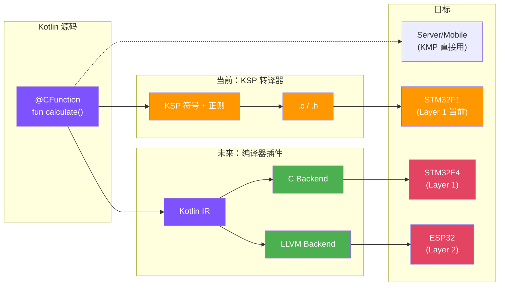

# Part 6：未来展望

---

# 未来方向：从转译器到编译器

<div class="grid grid-cols-2 gap-8">
<div>

### 路径 A：Kotlin/C 编译器插件

**当前痛点**：KSP 只给符号，函数体靠正则解析

**解决方案**：写编译器插件，直接访问 Kotlin IR

```kotlin
// 编译器已解析好函数体
override fun transform(fn: IrFunction) {
    fn.body?.statements  // 完整 IR
}
```

**产出**：.c / .h 源码，用户用 arm-gcc 编译

</div>
<div>

### 路径 B：Kotlin/RTOS 轻量运行时

**目标**：在 ESP32/STM32 上支持更多 Kotlin 特性

| 层级      | 运行时大小   | 支持特性      |
|---------|---------|-----------|
| Layer 1 | 0 KB    | 纯计算 (当前)  |
| Layer 2 | ~20 KB  | +协程 +集合   |
| Layer 3 | ~300 KB | 完整 Kotlin |

**关键**：协程 → RTOS 任务，引用计数代替 GC

</div>
</div>

<!--
**P20 未来方向：从转译器到编译器**
⏱️ 29:00 - 32:00

未来有两条演进路径。

**路径 A：Kotlin/C 编译器插件**

当前 KSP 方案的核心痛点是：KSP 只提供符号信息，函数签名它知道，但函数体内部是什么不知道。所以我们要从源文件用正则匹配提取函数体，这个方法很脆弱，复杂表达式容易解析错误。

解决方案是写 Kotlin 编译器插件。编译器插件可以直接访问 Kotlin IR，函数体已经被 K2 前端解析好了，所有语句、表达式、类型信息都有，不需要自己解析。

缺点是 Kotlin IR 是内部 API，不稳定，版本升级可能需要适配。但对于我们的场景，这个代价是值得的。

**路径 B：Kotlin/RTOS 轻量运行时**

这条路更激进。当前 Layer 1 是零运行时，只能做纯计算。Kotlin/Native 的 Layer 3 是完整运行时，300 多 KB，MCU 跑不动。

我们想做的是 Layer 2：一个 20-30 KB 的轻量运行时，跑在 FreeRTOS 上。

核心思路是借用 RTOS 的基础设施：
- 用 RTOS 的 malloc/free 做堆分配
- 用引用计数代替 GC，确定性释放，无停顿
- 把 Kotlin 协程映射到 RTOS 任务，delay 变成 vTaskDelay，launch 变成 xTaskCreate
- 用 setjmp/longjmp 实现简化的异常处理

这样在 ESP32（520KB RAM）上可以支持 class、集合、协程、异常这些特性，覆盖日常开发的大部分场景。

两条路可以共用同一个编译器插件前端，区别只在后端代码生成。
-->

---

# 目标：Write Kotlin, Run Everywhere



<div class="text-center mt-4">

**算法只写一遍 Kotlin** → 服务端直接用 / 客户端 KMP 复用 / MCU 自动生成

</div>

<!--
**P21 目标：Write Kotlin, Run Everywhere**
⏱️ 32:00 - 34:00

看一下最终目标架构。

核心思路是：算法只写一遍 Kotlin，根据目标平台选择不同的编译路径。

服务端和移动端最简单，用 KMP 直接跑，这是现在就能做的。

嵌入式设备走编译器插件。插件拿到 Kotlin IR 之后，根据目标选择后端：

**C Backend（路径 A）**：生成 .c 和 .h 文件，用户用 arm-none-eabi-gcc 或 riscv32-esp-elf-gcc 编译。这个方案的好处是：
- 生成的 C 代码可读，方便调试
- 可以集成到现有嵌入式项目
- 不需要额外运行时

适合 STM32F1 这种资源极度受限的设备。

**LLVM Backend（路径 B）**：从 Kotlin IR 生成 LLVM IR，配合轻量运行时直接编译成二进制。这个方案：
- 一站式编译，开发者不需要碰 C
- 支持更多 Kotlin 特性（协程、集合、异常）
- 需要 RTOS 和更多 RAM

适合 ESP32、STM32F4 这种有一定资源的设备。

设备选型：
- STM32F1（20KB RAM）：只能用 Layer 1，纯计算
- STM32F4（192KB RAM）：可以选 Layer 1 或 Layer 2
- ESP32（520KB RAM）：推荐 Layer 2，完整体验

最终目标就是这句话：**Write Kotlin once, run on Server / Mobile / MCU**。

算法只写一遍，服务端调试验证，移动端 KMP 复用，嵌入式自动生成。这就是我们的未来方向。
-->
